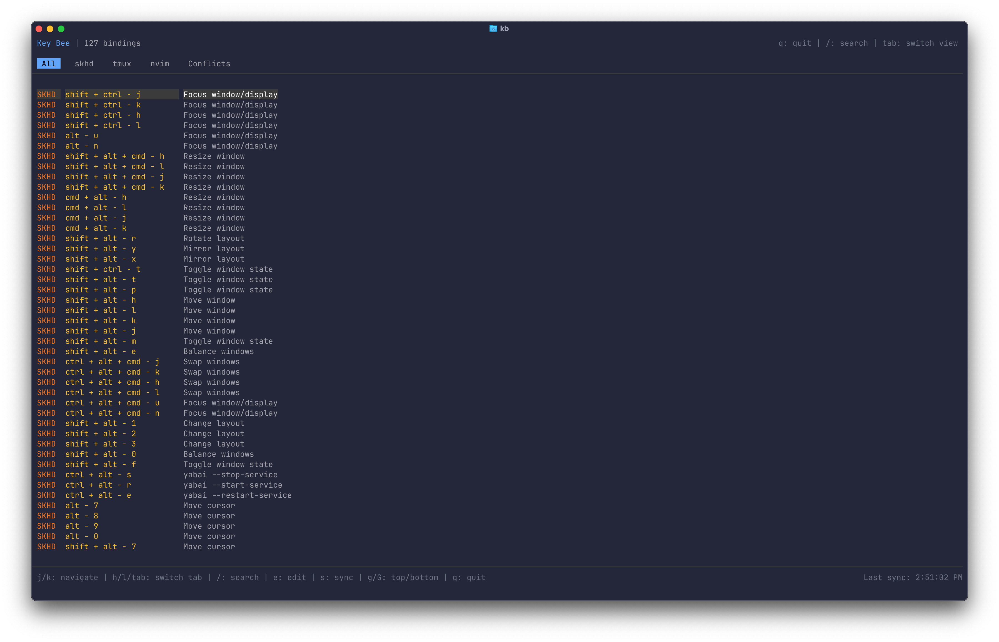

# Key Bee 🐝

[](https://www.npmjs.com/package/@mifwar/key-bee)
[](https://opensource.org/licenses/MIT)
[](https://nodejs.org)

A terminal user interface for browsing and searching all your **keyb**indings across different tools.

Built with [Ink](https://github.com/vadimdemedes/ink) + [React](https://react.dev).



## Features

- **Multi-tool support**: skhd, tmux, nvim, karabiner, zsh, hammerspoon
- **Fuzzy search**: Find any keybinding instantly
- **Conflict detection**: Identify overlapping keybindings across tools
- **Auto-discovery**: Automatically finds config files in your dotfiles
- **Change detection**: Detects when config files change
- **Custom parsers**: Add your own tools via regex patterns
- **Multiple paths**: Search across multiple dotfiles locations

## Installation

```bash
# Run directly (no install)
npx @mifwar/key-bee

# Or install globally
npm install -g @mifwar/key-bee
kb
```

## Usage

### First Run

On first run, a setup wizard will guide you through:

1. **Add search paths** - Where are your dotfiles? (e.g., `~/code/dotfiles`, `~/.config`)
2. **Select configs** - Choose which discovered config files to include

### Navigation

| Key            | Action                |
| -------------- | --------------------- |
| `j/k`          | Navigate up/down      |
| `h/l` or `Tab` | Switch tabs           |
| `/` or `f`     | Search                |
| `e`            | Edit selected config  |
| `s`            | Sync (reload configs) |
| `g/G`          | Go to top/bottom      |
| `Ctrl+R`       | Re-run setup          |
| `q`            | Quit                  |

### Tabs

- **All** - All keybindings from all tools
- **[tool]** - Filter by specific tool (skhd, tmux, nvim, etc.)
- **Conflicts** - Show keybindings that conflict across tools

## Configuration

Config is stored at `~/.config/key-bee/config.json`:

```json
{
  "basePaths": ["~/code/dotfiles", "~/.config"],
  "sources": [
    { "type": "skhd", "path": "skhd/skhdrc" },
    { "type": "tmux", "path": "~/.tmux.conf" },
    { "type": "nvim-keymap", "path": "nvim/lua/config/keymaps.lua" }
  ],
  "autoSync": true
}
```

### Custom Parsers

Add custom tools using regex patterns:

```json
{
  "sources": [
    {
      "type": "custom",
      "name": "aerospace",
      "path": "~/.aerospace.toml",
      "pattern": "^([a-z-]+)\\s*=\\s*['\"]([^'\"]+)['\"]",
      "keyGroup": 1,
      "actionGroup": 2,
      "commentPrefix": "#",
      "color": "#ff6b6b"
    }
  ]
}
```

The `color` field is optional - custom tools without it will use gray.

### Supported Path Formats

```json
{
  "sources": [
    { "type": "skhd", "path": "skhd/skhdrc" },
    { "type": "tmux", "path": "~/.tmux.conf" },
    { "type": "karabiner", "path": "/absolute/path/to/karabiner.json" }
  ]
}
```

- **Relative paths** - Searched in all `basePaths`
- **Tilde paths** - Expanded to home directory
- **Absolute paths** - Used as-is

### Editor Integration

Press `e` to open the selected config in your editor. The app uses `$EDITOR`, then `$VISUAL`, then falls back to `vim`.

## Built-in Parsers

| Type          | Files                     | Description            |
| ------------- | ------------------------- | ---------------------- |
| `skhd`        | `skhdrc`, `.skhdrc`       | skhd hotkey daemon     |
| `tmux`        | `.tmux.conf`, `tmux.conf` | tmux keybindings       |
| `nvim-keymap` | `keymaps.lua`, `keys.lua` | Neovim Lua keymaps     |
| `karabiner`   | `karabiner.json`          | Karabiner-Elements     |
| `zsh-alias`   | `.zshrc`                  | Zsh aliases & bindkeys |
| `hammerspoon` | `init.lua`                | Hammerspoon hotkeys    |

## Tech Stack

- [Ink](https://github.com/vadimdemedes/ink) - Terminal UI framework
- [React](https://react.dev) - UI components
- [Node.js](https://nodejs.org) - JavaScript runtime
- [Fuse.js](https://fusejs.io) - Fuzzy search

## Contributing

PRs welcome! Ideas: more built-in parsers (aerospace, raycast, wezterm, etc.)

## License

MIT
